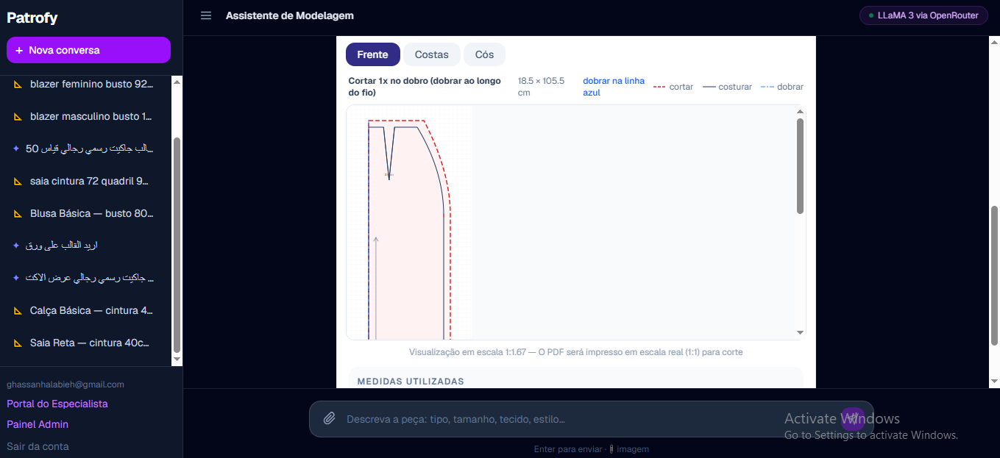

# Patrofy — Geração de Moldes de Costura com IA

**Moldes de costura profissionais gerados por inteligência artificial em segundos.**

<!-- Se o domínio patrofy.ai já estiver no ar publicamente, descomente a linha abaixo -->
<!-- 🔗 **[patrofy.ai](https://patrofy.ai)** — aplicação em produção -->



---

## O problema

A modelagem de uma peça de roupa é uma das etapas mais caras e demoradas da confecção: exige um modelista experiente, mão de obra escassa no mercado, e o retorno costuma levar dias. Para costureiros autônomos, ateliês e pequenas confecções, isso significa esperar por um profissional externo a cada nova peça — ou abrir mão de personalização.

O Patrofy encurta esse caminho: o usuário descreve a peça e informa as medidas, e recebe em segundos um molde técnico completo, com dimensões, marcações e orientações de corte.

---

## Como funciona

```
Descrição textual/imagem + medidas do usuário
                ↓
     Prompt estruturado (engenharia de prompt)
                ↓
        LLaMA 3 (via OpenRouter)
                ↓
   Interpretação da peça + medidas sugeridas
                ↓
   Motor paramétrico determinístico (lib/patterns)
                ↓
      Molde técnico em SVG, pronto para corte
```

A IA nunca desenha a geometria diretamente — ela interpreta a intenção do usuário (tipo de peça, medidas, tecido). Quem calcula e desenha o molde é sempre o motor paramétrico determinístico, o que evita que o modelo "invente" uma medida ou curva incorreta.

---

## Funcionalidades

- **Geração de moldes por descrição textual ou imagem** — o usuário descreve a peça em linguagem natural ou envia uma foto de referência
- **Medidas sob medida** — moldes personalizados a partir das medidas informadas
- **Instruções técnicas completas** — dimensões, marcações e orientações de corte
- **Portal do Especialista** — modelistas cadastram conhecimento estruturado de modelagem (fórmulas, pontos, regras de construção e gradação por tamanho)
- **Histórico de gerações** — todos os moldes salvos e acessíveis a qualquer momento
- **Autenticação de usuários** — contas individuais com dados isolados
- **Interface bilíngue** — português e inglês

---

## Stack

| Camada | Tecnologia |
|---|---|
| Front-end | Next.js 16 (App Router, Turbopack), TypeScript, React 19 |
| Estilo | Tailwind CSS v4 |
| Back-end / Dados | Supabase (autenticação + PostgreSQL) |
| IA | LLaMA 3 (texto) e LLaMA 3.2 Vision (imagem), via OpenRouter |
| Exportação | jsPDF (PDF), SVG/DXF |
| Deploy | Vercel |

---

## Desafio técnico

> ⚠️ **Ajuste esta seção para descrever exatamente o que você fez.** É a parte mais lida por recrutadores técnicos — o texto abaixo é um ponto de partida, não uma descrição verificada.

O principal desafio não foi gerar texto, mas **garantir saída estruturada e tecnicamente válida** a partir de um modelo de linguagem, sem deixar a geometria do molde nas mãos do modelo.

Um molde de costura não admite ambiguidade: cada medida precisa existir, estar em centímetros e ser coerente com as demais. Um modelo generativo, por padrão, devolve prosa — e mesmo instruído a responder em JSON, ocasionalmente inclui texto explicativo, quebra a estrutura ou inventa campos.

A solução combinou três camadas:

1. **Engenharia de prompt com contrato explícito** — definição rígida do esquema de saída, com exemplos positivos e negativos, proibindo qualquer conteúdo fora do objeto JSON.
2. **Validação e sanitização da resposta** — limpeza de delimitadores residuais, parsing seguro e verificação de que todos os campos obrigatórios existem antes de qualquer uso.
3. **Motor determinístico como fonte da verdade geométrica** — a IA só extrai medidas e tipo de peça; quem gera a geometria real (pontos, curvas, costuras) é sempre o motor paramétrico em `lib/patterns`, nunca o modelo de linguagem.

O aprendizado central: tratar a saída do LLM como **entrada não confiável**, sujeita a validação, e não como resultado final.

---

## Rodando localmente

```bash
git clone https://github.com/ghassanhalabieh1992/patrofy.git
cd patrofy
npm install
```

Crie um arquivo `.env.local` na raiz:

```env
NEXT_PUBLIC_SUPABASE_URL=sua_url_do_supabase
NEXT_PUBLIC_SUPABASE_ANON_KEY=sua_chave_anonima
OPENROUTER_API_KEY=sua_chave_do_openrouter
```

Aplique os schemas do banco no seu projeto Supabase (`supabase_schema.sql` para autenticação/moldes, e `supabase_schema_knowledge.sql` para o Portal do Especialista) e inicie o servidor:

```bash
npm run dev
```

A aplicação ficará disponível em `http://localhost:3000`.

---

## Roadmap

- [ ] Validar o primeiro molde completo cadastrado no Portal do Especialista
- [ ] Motor que lê o conhecimento cadastrado pelos especialistas e gera o molde automaticamente
- [ ] Exportação de moldes em PDF em escala real
- [ ] Geração a partir de imagem de peça existente (visão computacional)
- [ ] Gerador de dataset sintético a partir do motor de geometria
- [ ] Ajuste fino de modelo com base em moldes reais validados

---

## Autor

**Ghassan Halabieh** — Desenvolvedor e estudante de Inteligência Artificial e Machine Learning (Uniasselvi).

Projeto nascido da união entre mais de uma década de vivência no setor têxtil e de confecção e a formação em IA.

[LinkedIn](https://www.linkedin.com/in/ghassan-halabieh-328b14385) · [GitHub](https://github.com/ghassanhalabieh1992)

---

## Licença

<!-- Nenhum arquivo LICENSE encontrado no repositório ainda — adicione um (ex: MIT) antes de declarar a licença aqui -->
